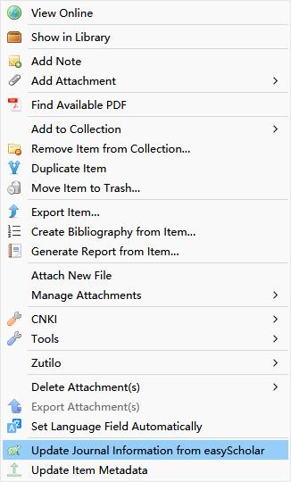
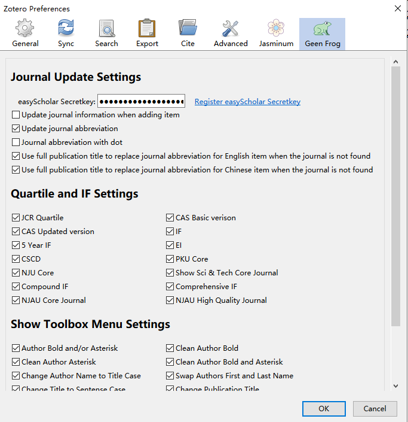
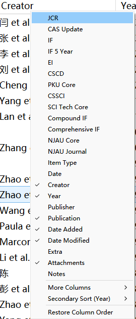
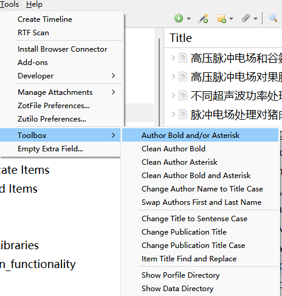

# Green Frog

感谢[easyScholar](https://easyscholar.cc)提供数据接口，[easyScholar](https://easyscholar.cc)是一个强大的浏览器插件，提供了很多有用期刊数据，详情访问：<https://easyscholar.cc>。感谢@dawnlh 提供期刊缩写数据，感谢@l0o0 提供的期刊缩写接口和中文期刊复合和综合影响子代码。

# 主要功能：
1. 插件安装后在分类及条目上右击会出现`从easyScholar更新期刊信息`，点击将根据条目语言从[easyScholar](https://easyscholar.cc)获取期刊或会议论文（需要将会议名称填入`Conference Name`字段）`JCR分区`、`中科院分区基础版`、`中科院分区升级版`、`影响因子`和`5年影响因子`、`EI`及中文期刊更新是否南`南农大核心期刊`、`南农大高质量期刊（仅含食品科学与工程）`、`中国科技核心期刊`、`CSCD收录`、`北大/南大核心`、`科技核心`、`EI`，`SSCI`、`AJG`、`UTD24`、`FT50`、`CCF`、`FMS`、`JCI`、`AHCI`、`复合影响因子`，`综合影响因子`、各个大学对期刊的分类及[easyScholar](https://easyscholar.cc)自定义数据集（详见[easyScholar](https://easyscholar.cc)，如果要使用自定义数据集，需要在[easyScholar](https://easyscholar.cc)网站中登录，添加并在easyScholar浏览器插件中选中需要的自定义数据集）并保存在`Extra`字段，如果显示不正常请先清除`其它`（`Extra`）字段。并可在`Edit`-`Preferences`-`Green Frog`中设置哪些字段在列中显示（默认全部显示，如果不需要可以关闭），然后在列上右击即可显示相应字段。

在`Edit`-`Preferences`-`Green Frog`中设置要获取的内容和显示的工具箱菜单：

在列上右键设置显示的内容：

2. 更新条目元数据。

3. 清除`其它`字段内容（`工具`-`清除其它内容...`）。

4. 给作者加粗、加星、清除加粗、清除加星；将文献题目改为首字母大写；更改期刊题目；更改期刊题目大小写；作者姓名改为词首字母大写；交换作者姓和名；显示配置目录，显示数据目录等小工具（`工具`-`工具箱`）。

在Tools-Toolbox显示：

5. 更新期刊缩写，带点或不带点。目前期刊缩写数据库只有5000多条数据，可以设置如果英语或中文条目期刊缩写查询不到时是否用全称代替（会根据语言字段进行判断，英语为`en`或`English`，中文为`ch`、`zh`、`中文`或`CN`），语言设置可以使用[Delitem插件](https://github.com/redleafnew/delitemwithatt)）。

# 安装方法

1. 从<https://github.com/redleafnew/zotero-updateifsE/releases/latest/download/greenfrog.xpi>下载xpi，然后在Zotero或JurisM中通过Tools-Addons-Install Add-on From File安装。

2. 到[easyScholar](https://easyscholar.cc/)注册一个账号，并登录账号，点击注册的用户名-`用户信息`-`开放接口`，复制密钥。在Zotero中点击`Edit`-`Preferences`-`Green Frog`，粘贴到easyScholar密钥后的文本框内。

# 感谢

本插件基于@windingwind的[zotero-plugin-template](https://github.com/windingwind/zotero-plugin-template)开发，在此表示感谢。

感谢@windingwind 开发工具箱，[Zotero Plugin Toolkit](https://github.com/windingwind/zotero-plugin-toolkit)。

1. Update `JCR Quartile`, `CAS Quartile`, `impact factor`,  `5 year impact factor` and `EI` using name of the journal from [easyScholar](https://easyscholar.cc). A context menu `Update Journal Infomation from easyScholar` appears, the  `JCR Quartile`, `CAS Quartile`, `EI` `impact factor`, `5 year impact factor`, `SSCI`, `AJG`, `UTD24`, `FT50`, `CCF`, `FMS`, `JCI` and `AHCI` and some universities' journal category will be fetched from [easyScholar](https://easyscholar.cc) and  saved to `Extra` field.

2. Update item Metadata.

3. Remove `Extra` field content (`Tools`-`Clean Extra Field...`).

4. Bold, asterisk, remove bold, remove asterisk for author name; Change the item(s) title to sentence case; Change publication title; Change publication title case; Author name to title case; Swap author name first and last name; Show the profile and data directory (Use `Tools`-`Toolbox`).

5. Update journal abbreviation with or without dot.

# Installation
1. Download xpi from <https://github.com/redleafnew/zotero-updateifsE/releases/latest/download/greenfrog.xpi>, and click Tools-Addons-Install Add-on From File in Zotero or JurisM to install the extension.

2. Register at [easyScholar](https://easyscholar.cc/) and log in，copy the secret key at user information, and paste to Green Frog Preference。

# Disclaimer

This plugin based on @windingwind's [zotero-plugin-template](https://github.com/windingwind/zotero-plugin-template)，many thanks for his team's hard working。

We also acknowledge @windingwind's [Zotero Plugin Toolkit](https://github.com/windingwind/zotero-plugin-toolkit)。

# License

Copyright (C) 2023 Minyi Han

Distributed under the Mozilla Public License (MPL).
